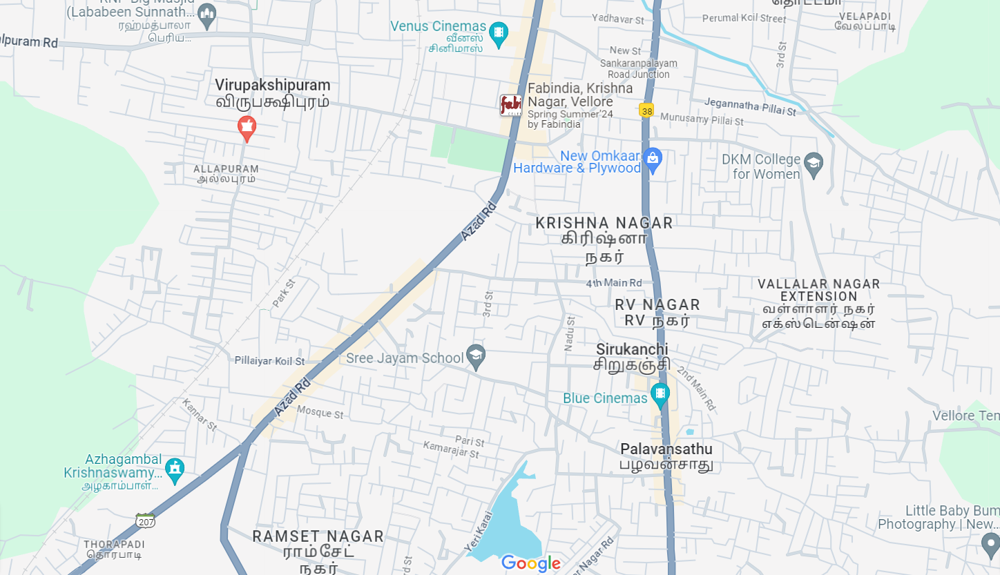

# Ex04 Places Around Me
## Date: 29.03.2024

## AIM
To develop a website to display details about the places around my house.

## DESIGN STEPS

### STEP 1
Create a Django admin interface.

### STEP 2
Download your city map from Google.

### STEP 3
Using ```<map>``` tag name the map.

### STEP 4
Create clickable regions in the image using ```<area>``` tag.

### STEP 5
Write HTML programs for all the regions identified.

### STEP 6
Execute the programs and publish them.

## CODE
```
map.html

+<html>
<head>
<title>My City</title>
</head>
<body>
<h1 align="center">
<font color="red"><b>Chidambaram</b></font>
</h1>
<h3 align="center">
<font color="blue"><b>Susithra (212223220113)</b></font>
</h3>
<center>

<map name="MyCity"> 
<area shape="rect" coords="400,250,600,375" href="place.html" title="Railway Station">
<area shape="rect" coords="969,342,1111,430" href="college.html" title="Annamalai university">
<area shape="rect" coords="900,346,1000,430" href="river.html" title="Uppanaru River">
<area shape="circle" coords="465,104,66" href="temple.html" title="Natrajar Temple">
<area shape="circle" coords="701,397,25" href="home.html" title="My Home">
</map>
</center>
</body>
</htm1>

home.html

<html>
<head>
<title>My Home Town</title>
</head>
<body bgcolor="pink">
<h1 align="center">
<font color="red"><b>Chidambaram</b></font>
</h1>
<h3 align="center">
<font color="blue"><b>My Home</b></font>
</h3>
<hr size="3" color="red">
<p align="justify">
<font face="Georgia" size="5">
    Chidambaram is a town located in the Cuddalore district of the Indian state of Tamil Nadu. It holds significant cultural, religious, and historical importance, particularly due to its association with the Nataraja Temple, one of the holiest Hindu temples dedicated to Lord Shiva.
Here are some key points about Chidambaram:
Nataraja Temple: The Nataraja Temple in Chidambaram is the town's most iconic landmark. It is dedicated to Lord Shiva in his form as Nataraja, the cosmic dancer. The temple is renowned for its architectural splendor, spiritual significance, and the annual Natyanjali Dance Festival celebrated within its premises.
Cultural Heritage: Chidambaram has a rich cultural heritage deeply rooted in music, dance, and spirituality. The town has been a center for classical arts, particularly Bharatanatyam (a classical Indian dance form), which is closely associated with the Nataraja Temple.
Pilgrimage Destination: Due to the presence of the Nataraja Temple, Chidambaram is a significant pilgrimage destination for Hindus, attracting devotees from all over India and beyond. The temple is one of the Pancha Bhoota Sthalas, representing the element of akasha (space).
Geographical Location: Chidambaram is situated in the fertile plains of the Cauvery delta region, known for its agriculture, particularly paddy cultivation. The town is located approximately 235 kilometers south of Chennai, the capital city of Tamil Nadu.
</body>
</htm1>

temple.html

<html>
<head>
<title>My Home Town</title>
</head>
<body bgcolor="pink">
<h1 align="center">
<font color="red"><b>Chidambaram</b></font>
</h1>
<h3 align="center">
<font color="blue"><b>Natrajar Temple</b></font>
</h3>
<hr size="3" color="red">
<p align="justify">
<font face="Georgia" size="5">
    The Nataraja Temple, also known as Thillai Nataraja Temple, is a famous Hindu temple dedicated to Lord Shiva in his dancing form as Nataraja. It is located in the town of Chidambaram, Tamil Nadu, India. The temple is one of the most significant and ancient Shiva temples in the region and holds great religious and cultural importance.
Here are some key points about the Nataraja Temple in Chidambaram:
Architecture: The temple complex is renowned for its architectural beauty and intricate design. The main sanctum sanctorum, known as the Chit Sabha or Kanaka Sabha, is dedicated to Lord Nataraja. The temple architecture follows the Dravidian style, characterized by towering gopurams (gateway towers), pillared halls, and intricately carved sculptures.
Significance: The Nataraja Temple is considered one of the Pancha Bhoota Stalas, representing the five elements of nature. It represents the element of akasha (space). The temple's sanctum sanctorum houses the iconic bronze sculpture of Lord Nataraja performing the cosmic dance, symbolizing the continuous cycle of creation and destruction.
Mythological and Historical Importance: According to Hindu mythology, the temple site is believed to be the place where Lord Shiva performed his cosmic dance (Tandava) in the presence of sages and deities. The temple has a rich historical legacy and has been mentioned in ancient Tamil texts and scriptures.
</body>
</htm1>

college.html

<html>
<head>
<title>My Home Town</title>
</head>
<body bgcolor="pink">
<h1 align="center">
<font color="red"><b>Chidambaram</b></font>
</h1>
<h3 align="center">
<font color="blue"><b>Annamalai university</b></font>
</h3>
<hr size="3" color="red">
<p align="justify">
<font face="Georgia" size="5">
    Annamalai University is a prominent public state university located in Annamalai Nagar, Chidambaram, Tamil Nadu, India. It is one of the largest residential universities in Asia, offering a wide range of undergraduate, postgraduate, and doctoral programs in various disciplines.
    Here are some key points about Annamalai University:
    Establishment: Annamalai University was established in 1929 by the philanthropist and visionary Dr. Rajah Sir Annamalai Chettiar. It started as a private university and later became a public university after its takeover by the government of Tamil Nadu.
    Campus: The university's campus is spread over 1,500 acres of land, making it one of the largest campuses in India. It includes academic buildings, hostels, sports facilities, and other amenities to cater to the needs of students and faculty.
    Academic Programs: Annamalai University offers a wide range of academic programs across various disciplines, including Arts, Science, Engineering, Agriculture, Medicine, Dentistry, Pharmacy, Education, Law, Management, and Fine Arts. It also offers distance education programs through its Directorate of Distance Education (DDE), which is one of the largest distance education providers in the country.
</p>
</body>
</htm1>

place.html

<html>
<head>
<title>My Home Town</title>
</head>
<body bgcolor="pink">
<h1 align="center">
<font color="red"><b>Chidambaram</b></font>
</h1>
<h3 align="center">
<font color="blue"><b>Chidambaram Railway Station</b></font>
</h3>
<hr size="3" color="red">
<p align="justify">
<font face="Georgia" size="5">
 Chidambaram Railway Station is situated on the main Chennai Tiruchirapalli line, 
 which is a significant route connecting the capital city of Tamil Nadu, Chennai, 
 with various destinations in the southern part of the state and beyond. The station is well-connected to major cities like Chennai, Tiruchirapalli, Madurai, Coimbatore, and others.
</p>
</body>
</htm1>

river.html

<html>
<head>
<title>My Home Town</title>
</head>
<body bgcolor="pink">
<h1 align="center">
<font color="red"><b>Chidambaram</b></font>
</h1>
<h3 align="center">
<font color="blue"><b>Uppanaru River</b></font>
</h3>
<hr size="3" color="red">
<p align="justify">
<font face="Georgia" size="5">
    Origin and Course: The Uppanar River originates in the Eastern Ghats and flows through various regions of Tamil Nadu before reaching the Bay of Bengal. It passes through Chidambaram town, making it an essential water body for the local community.
    Cultural Significance: The Uppanar River is associated with various religious and cultural activities in Chidambaram. It is often mentioned in ancient Tamil literature and plays a significant role in the rituals and ceremonies conducted in temples and along its banks.
    Ecological Importance: The river supports a diverse ecosystem along its course, providing habitats for various species of flora and fauna. However, like many rivers in India, the Uppanar River faces challenges such as pollution and encroachment, which affect its ecological health.
</p>
</body>
</htm1>
```

## OUTPUT



## RESULT
The program for implementing image maps using HTML is executed successfully.
